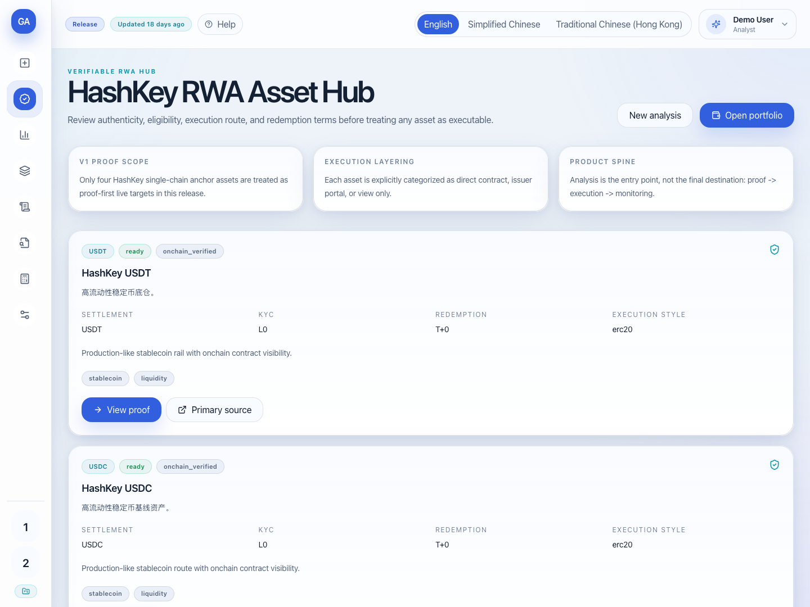
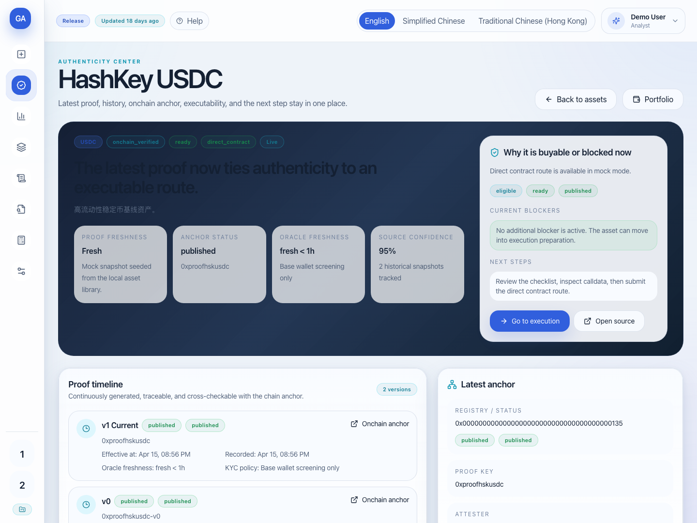
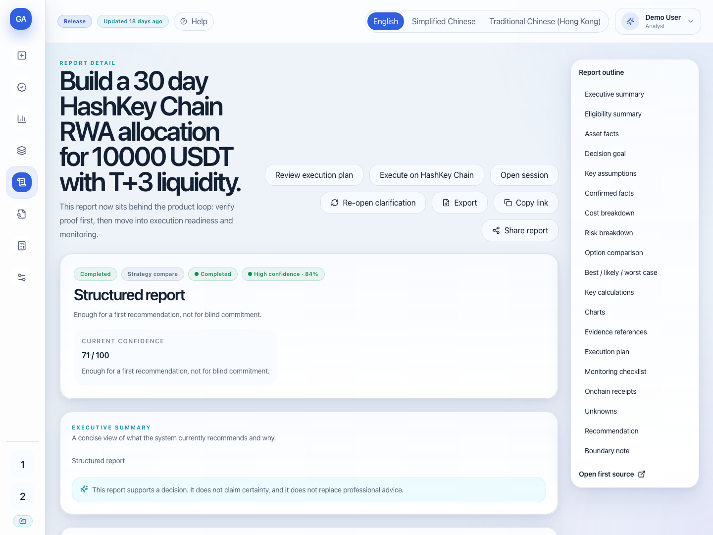
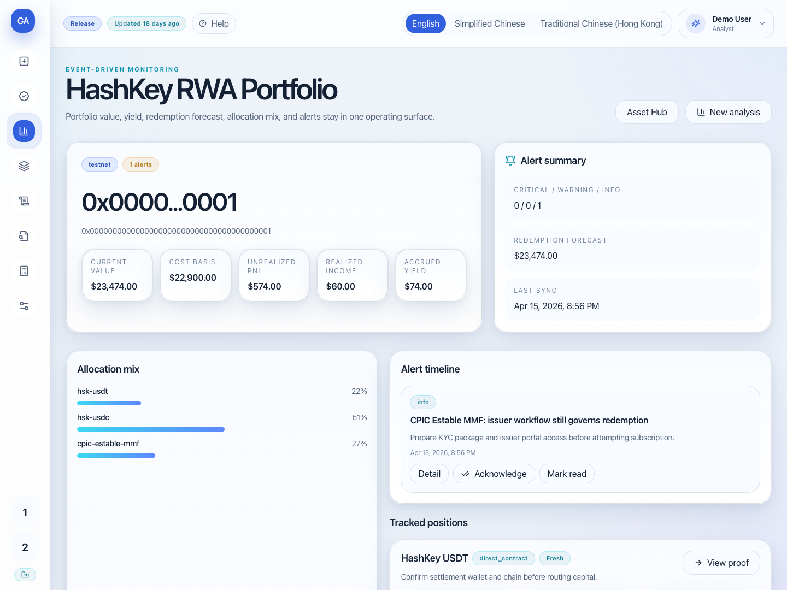

# Genius Actuary

AI-powered verifiable RWA decision, execution, and monitoring hub on HashKey Chain, aligned with the `DeFi` track.

## What This Project Is

Genius Actuary is a judge-friendly RWA workbench for HashKey Chain. It brings the current product loop into one flow:

- `proof`: inspect asset proof snapshots, source refs, freshness, and onchain anchor state
- `readiness`: check wallet-aware KYC, oracle, and route availability
- `execution`: prepare and review execution payloads, receipts, and next-step routing
- `monitoring`: track portfolio alerts, proof freshness, yield, PnL, and redemption windows

The product is not a generic chat assistant. It is a DeFi-focused RWA interface for verifying assets, deciding between eligible routes, preparing execution, and monitoring live positions.

## Why It Fits the DeFi Track

- It is built around HashKey Chain RWA flows, not a generic AI demo.
- The current asset universe already covers stablecoin, MMF-style, precious-metals, and real-estate-style RWA use cases.
- The product combines onchain context, issuer-route readiness, execution planning, and portfolio monitoring in one workspace.
- AI is used as an analysis layer, but the main submission is a DeFi/RWA application with verifiable product surfaces.

## Core Capabilities

- Asset catalog and proof pages under `/assets` and `/assets/{assetId}/proof`
- Wallet-aware readiness checks with KYC and oracle context
- RWA analysis and report flow from `/new-analysis` through final report pages
- Execution preparation, submission routing, and receipt inspection at `/sessions/{sessionId}/execute`
- Portfolio monitoring with alerts, allocation mix, accrued yield, and redemption forecasts at `/portfolio/{address}`
- Protected RWA ops console at `/debug/rwa-ops` for proof refresh, publishing, and indexer status

## Live vs Demo Assets

Live scope in the current repo:

- `hsk-usdt`
- `hsk-usdc`
- `cpic-estable-mmf`
- `hk-regulated-silver`

Visible but not submittable:

- `tokenized-real-estate-demo` (`demo_only`)
- `hsk-wbtc-benchmark` (`benchmark_only`)

These two assets can still appear in proof and comparison flows, but submit requests are blocked server-side and should not be presented as live-buyable assets.

## Quick Start

Recommended local stack:

- Node.js `20+`
- Python `3.12` or `3.13`

Copy the example environment file:

```bash
cp .env.local.example .env.local
```

Start the backend:

```bash
cd backend
python3 -m venv .venv
source .venv/bin/activate
python -m pip install -r requirements.txt
python -m uvicorn app.main:app --host 127.0.0.1 --port 8000 --reload
```

Start the frontend in a second terminal:

```bash
cd frontend
npm install
npm run dev
```

Open `http://localhost:5173`.

For detailed setup and environment notes, see [backend/README.md](backend/README.md) and [frontend/README.md](frontend/README.md).

## 3-Minute Demo Flow

Recommended local judging mode:

- frontend: `VITE_API_MODE=mock`
- backend: `ANALYSIS_ADAPTER=mock`

Stable mock frontend command:

```bash
cd frontend
VITE_API_MODE=mock npm run dev -- --mode test
```

Walk the product in this order:

1. Open `/assets` to show the current RWA catalog and proof/readiness overview.
2. Open `/assets/hsk-usdc/proof` to show proof freshness, timeline, source refs, and anchor state.
3. From `/new-analysis`, use an example prompt to create a demo session and open the final report.
4. Open `/portfolio/0x0000000000000000000000000000000000000001` or `/portfolio` to show monitoring, positions, and alerts.
5. Optionally open `/debug/rwa-ops` to show the protected operator surface.

For a demo workspace entry, use the `Open demo workspace` action on `/login`.

## Screenshots

### Asset Hub



Desktop demo view of the RWA catalog and proof/readiness entrypoints.

### Proof Page



Proof snapshot, freshness, anchor context, readiness, and source references for `hsk-usdc`.

### Report Page



Demo report output with comparison, evidence-linked reasoning, and execution posture.

### Portfolio Page



Portfolio monitoring with tracked positions, alerts, allocation mix, and redemption visibility.

## Repository Structure

- `backend/`: FastAPI API, session orchestration, proof/readiness services, RWA engine, persistence, KYC/oracle services
- `frontend/`: React + TypeScript + Vite product UI
- `contracts/`: `PlanRegistry` and `AssetProofRegistry`
- `sdk/js/`: minimal read-only JS SDK for the proof layer
- `docs/api/`: public proof-layer documentation and embed references
- `reports/`: generated validation output and test summaries

## API / SDK / Validation References

- Public proof-layer docs: [docs/api/rwa-proof-layer.md](docs/api/rwa-proof-layer.md)
- JS SDK: [sdk/js/README.md](sdk/js/README.md)
- Backend setup and API notes: [backend/README.md](backend/README.md)
- Frontend setup and UI notes: [frontend/README.md](frontend/README.md)
- Validation summary: [reports/test-summary.md](reports/test-summary.md)

Validated on **April 15, 2026**.

Latest recorded summary:

- Backend: `148 passed`
- Frontend unit: `57 passed`
- Frontend E2E: `11 passed`
